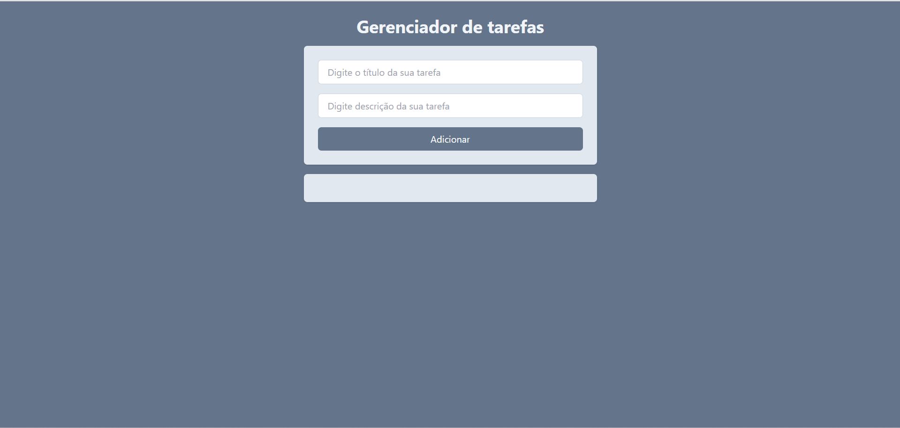
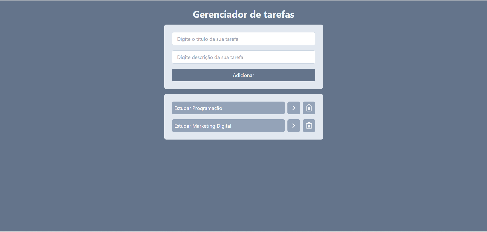
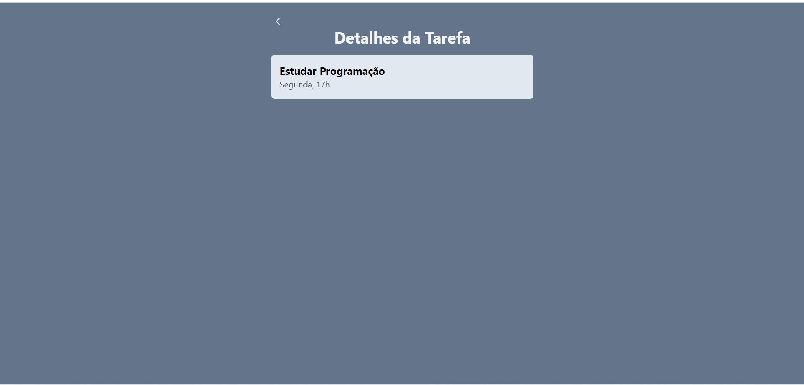

# React + Vite

This template provides a minimal setup to get React working in Vite with HMR and some ESLint rules.

Currently, two official plugins are available:

# Gerenciador de Tarefas 📝

## Descrição

Um aplicativo web simples para gerenciar tarefas diárias. Permite adicionar, visualizar e detalhar tarefas de forma prática e intuitiva.

## Tecnologias Utilizadas

- React
- Vite
- Tailwind CSS
- JavaScript
- HTML
- CSS

## Pré-requisitos

- Node.js (versão recomendada: 18+)
- npm ou yarn
- Navegador web moderno

## Instalação e Execução

1. Clone o repositório:
   ```bash
   git clone https://github.com/Helcio-Nogueira/Gerenciador-de-Tarefas.git
   ```
2. Instale as dependências:
   ```bash
   npm install
   ```
3. Inicie o projeto:
   ```bash
   npm run dev
   ```
4. Acesse `http://localhost:5173` no navegador.

## Deploy / Demonstração

- [https://gerenciador-de-tarefas-brown.vercel.app/]
- 
- 
- 

## Funcionalidades

- Adicionar nova tarefa
- Listar tarefas
- Visualizar detalhes da tarefa
- Marcar tarefas como concluídas
- Remover tarefas

## Estrutura de Pastas

```
├── public/
│   └── vite.svg
│   └── Gerenciador-de-Tarefas.png
│   └── Gerenciador-de-Tarefas-II.png
│   └── Gerenciador-de-Tarefas-III.png
├── src/
│   ├── App.jsx
│   ├── App.css
│   ├── index.css
│   ├── main.jsx
│   ├── assets/
│   ├── components/
│   │   ├── AddTask.jsx
│   │   ├── input.jsx
│   │   └── Tasks.jsx
│   └── Pages/
│       └── DetailsPage.jsx
```

## Contribuição

Contribuições são bem-vindas! Abra uma issue ou envie um pull request.

## Licença

Este projeto está licenciado sob a licença MIT.
